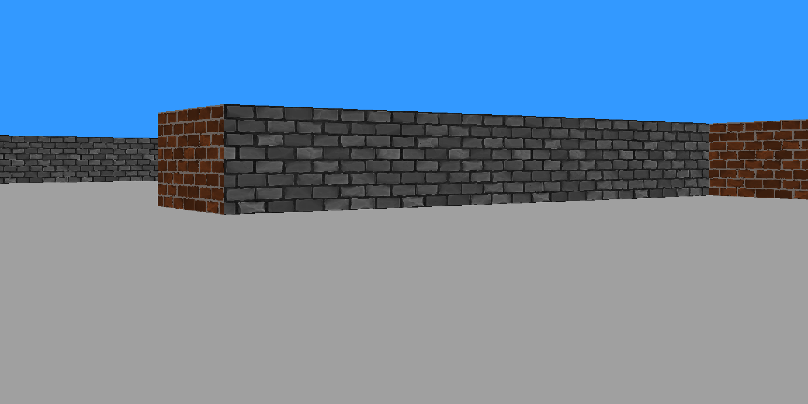

# Cub3D

Cub3D is a 3D game project inspired by Wolfenstein 3D. This project demonstrates foundational principles of computer graphics, including ray-casting, 3D rendering, and basic game mechanics. It is built using the C programming language and the MinilibX library.




## Features

- **2D Map Parsing**: Reads a configuration file to load a 2D map.
- **Ray-Casting Engine**: Implements a ray-casting algorithm to create a 3D perspective view.
- **Player Movement**: Supports smooth player movement and rotation.
- **Textured Walls**: Renders walls with textures loaded from external image files.
- **Basic Interactivity**: Includes keyboard controls for movement and looking around.
- **Error Handling**: Provides clear messages for map parsing or runtime errors.

## Getting Started

### Prerequisites

- A Unix-like operating system (Linux or macOS).
- GCC or a compatible C compiler.
- MinilibX library installed on your system.

### Installation

1. Clone the repository:
   ```bash
   git clone git@github.com:d2iv3r/cub3d.git
   cd cub3d
   ```
2. Compile the project:
   ```bash
   make
   ```

3. Run the game:
   ```bash
   ./cub3d path/to/map.cub
   ```

## Usage

- **Movement**:
  - `W`: Move forward
  - `S`: Move backward
  - `A`: Strafe left
  - `D`: Strafe right
  - `Left Arrow`: Rotate left
  - `Right Arrow`: Rotate right
- **Exit**:
  - Press `ESC` or close the game window.

## Map Configuration

The game reads maps from `.cub` files. These files include:

- **Map Layout**: Represented using characters (`1` for walls, `0` for empty space, `N/S/E/W` for player spawn).
- **Textures**:
  ```
  NO ./path_to_north_texture.xpm
  SO ./path_to_south_texture.xpm
  WE ./path_to_west_texture.xpm
  EA ./path_to_east_texture.xpm
  ```
- **Floor and Ceiling Colors**:
  ```
  F 220,100,0
  C 255,255,255
  ```

## Limitations

- Does not support non-rectangular or invalid maps.
- No advanced lighting or shading.
- Limited interactivity and no enemies or items.

## Subject
https://cdn.intra.42.fr/pdf/pdf/134785/en.subject.pdf


## Teammates

This project was developed collaboratively by:

- **MOHAMMED EL HARCHI**: [GitHub Profile](https://github.com/mel-harc)

---
